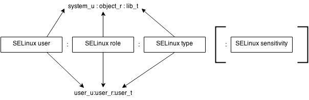

# SELinux Workshop
## Understand SELinux with hands-on exercises (RHEL 9/10)

<!-- _notes:
Welcome the group, confirm schedule and labs, explain this is hands-on.
-->

---

<!-- _class: right-bg-author -->
# About me

- René Koch
- Self-employed consultant for:
  - Red Hat Ansible (Automation Platform)
  - Red Hat Enterprise Linux
  - Red Hat Satellite
  - Red Hat Identity Management (IPA)

<!-- _notes:
Very short intro; emphasize practical focus and RHEL background.
-->

---

<!-- _class: right-bg-author -->
# About me

- René Koch
  - rkoch@rk-it.at
  - https://www.linkedin.com/in/rk-it-at
  - https://github.com/rk-it-at
  - https://github.com/scrat14

<!-- _notes:
Very short intro; emphasize practical focus and RHEL background.
-->

---

# Goals for today

- Understand what SELinux is and why it exists
- Explain DAC vs MAC with clear examples
- Read and interpret SELinux AVC logs
- Use audit2allow, setenforce, and booleans safely
- Fix real-world web issues (custom webroot, PHP access, outbound connections)
- Know what we are not doing: writing custom policy modules

<!-- _notes:
Set expectations and remind that we will not write custom policy modules.
-->

---

# Target environment

- RHEL 9 or RHEL 10
- SELinux in **enforcing** mode
- **root** access to system

<!-- _notes:
Confirm versions and packages; ask participants to verify SELinux enforcing.
-->

---

# Agenda (8 hours)

- 09:00-09:30 Introduction, SELinux overview
- 09:30-10:30 DAC vs MAC, SELinux concepts
- 10:30-10:45 Break
- 10:45-12:00 SELinux policy, labels, and file contexts (labs)
- 12:00-13:00 Lunch
- 13:00-14:00 Logs and troubleshooting workflow (labs)
- 14:00-14:15 Break
- 14:15-15:30 Booleans and common service scenarios (labs)
- 15:30-16:45 Web troubleshooting workshop (labs)
- 16:45-17:00 Wrap-up, Q&A

<!-- _notes:
Walk through timing, highlight breaks and lab-heavy afternoon.
-->

---

# Ground rules

- Everyone works on their own VM
- Ask questions anytime
- If you get stuck, show your last command and the error
- We keep SELinux enforcing throughout

<!-- _notes:
Encourage questions and sharing errors; enforcing mode stays on.
-->

---

# Lab setup

- You need root access
- Use two terminals:
  - one for commands
  - one for logs:
    ```bash
    $ sudo journalctl -f
    ```
    or
    ```bash
    $ sudo tail -f /var/log/audit/audit.log
    ```

<!-- _notes:
Ask everyone to open a log terminal now.
-->

---
# Exercise
## LAB 1: Access and baseline checks (10 min)

<!-- _notes:
Introduce LAB 1: Access and baseline checks (10 min) and expected outcome.
-->
---

# LAB 1: Access and baseline checks (10 min)

- SSH into your VM
- Switch to root:
  ```bash
  $ sudo -i
  ```
  or
  ```bash
  $ su -
  ```
- Tail the audit log:
  ```bash
  $ tail -f /var/log/audit/audit.log
  ```

---

# LAB 1: Access and baseline checks (10 min)

- Check RHEL version:
  ```bash
  $ cat /etc/redhat-release
  Red Hat Enterprise Linux release 10.1 (Coughlan)
  ```
- Verify repos:
  ```bash
  $ dnf repolist
  repo id                               repo name
  rhel-10-for-x86_64-appstream-rpms     Red Hat Enterprise Linux 10 for x86_64 - AppStream (RPMs)
  rhel-10-for-x86_64-baseos-rpms        Red Hat Enterprise Linux 10 for x86_64 - BaseOS (RPMs)
  ```

<!-- _notes:
Make sure everyone can log in, become root, and confirm RHEL version and repos.
-->

---

# LAB 1: Access and baseline checks (10 min)

- Install Apache:
  ```bash
  $ dnf install httpd
  ```

- Start and enable Apache:
  ```bash
  $ systemctl enable --now httpd
  ```

---
# Chapter 1
## Introduction and SELinux overview

<!-- _notes:
Start with the motivation and high-level view of SELinux.
-->

---

# What is SELinux?

- SELinux = Security-Enhanced Linux
- Mandatory Access Control (MAC) on top of DAC
- Enforces least privilege based on labels and policy
- Default in RHEL and trusted OS base for security compliance

<!-- _notes:
High-level definition and why it matters for containment.
-->

---

# History of SELinux

- Developed by the NSA as research into MAC for Linux
- First released to the open source community in 2000 (GPL)
- Merged into the mainline Linux kernel in the 2.6 series
- In RHEL, SELinux is enabled and enforcing by default on install

<!-- _notes:
Keep this short: origin, open source release, kernel integration, and default RHEL posture.
-->

---

# Compliance drivers (NIS2, DORA, benchmarks)

- Regulations like NIS2 and DORA push stronger security controls and auditability
- Many hardening baselines (CIS, DISA STIGs, internal policies) recommend SELinux enforcing
- Treat requirements as organization-specific: confirm with your policy or auditors

<!-- _notes:
Keep this non-legal; emphasize that compliance frameworks typically favor MAC/SELinux.
-->

---

# Why SELinux is useful (1/6)

- Enforces least privilege with labels and policy rules (deny by default)
- Confines services so a compromise has limited reach
- Complements DAC rather than replacing it

<!-- _notes:
Frame SELinux as containment and damage reduction, not a silver bullet.
-->

---

# Why SELinux is useful (2/6) Impact: Critical

- Log4Shell `CVE-2021-44228` (https://access.redhat.com/security/cve/CVE-2021-44228)
- Critical issues often allow remote, unauthenticated arbitrary code execution
- SELinux confines the vulnerable service, limiting the attack’s reach (e.g., sensitive files or further payloads)
- Reference: Red Hat SELinux hardening blog (https://www.redhat.com/en/blog/selinux-and-rhel-technical-exploration-security-hardening)

<!-- _notes:
A critical vulnerability, such as CVE-2021-44228 (Log4Shell), often allows remote unauthenticated attackers to execute arbitrary code. SELinux can mitigate the impact by confining vulnerable services within restrictive policies, limiting the attack’s reach. For instance, if the exploited process is running under a confined SELinux domain, it may not have the privileges to access sensitive files or execute further payloads.
-->

---

# Why SELinux is useful (3/6) Impact: Important

- Looney Tunables `CVE-2023-4911` (https://access.redhat.com/security/cve/CVE-2023-4911)
- Important issues can enable privilege escalation after an exploit
- SELinux policies can confine the elevated process and protect critical system components
- Reference: Red Hat SELinux hardening blog

<!-- _notes:
For important CVEs, such as CVE-2023-4911 (Looney Tunables), SELinux plays a vital role in restricting the scope of privilege escalation. Even if an attacker successfully exploits a buffer overflow to gain elevated privileges, SELinux policies can confine their activities, protecting critical system components.
-->

---

# Why SELinux is useful (4/6) Impact: Moderate

- Grafana issue `CVE-2023-3128` (https://access.redhat.com/security/cve/CVE-2023-3128)
- Moderate issues are often harder to exploit or require unlikely configurations
- SELinux adds a defense layer that helps prevent escalation of impact
- Reference: Red Hat SELinux hardening blog

<!-- _notes:
Moderate CVEs, like CVE-2023-3128 (Grafana issue), often rely on unlikely configurations or are difficult to exploit. SELinux policies act as an additional layer of defense, preventing such vulnerabilities from escalating into significant threats.
-->

---

# Why SELinux is useful (5/6) Impact: Low

- vim crash `CVE-2023-48232` (https://access.redhat.com/security/cve/CVE-2023-48232)
- Low-severity issues usually have limited consequences
- SELinux may not directly prevent the issue, but consistent enforcement helps contain theoretical attacks
- Reference: Red Hat SELinux hardening blog

<!-- _notes:
Low-severity issues, such as CVE-2023-48232 (vim crash), usually result in minimal consequences. While SELinux may not directly prevent such issues, its consistent policy enforcement helps contain even theoretical attacks.
-->

---

# Why SELinux is useful (6/6) Real-world example

- Scenario: Webserver is affected by vulnerability allowing remote code execution (RCE)
- Without SELinux: attacker can execute arbitary commands and potentially take control of the system
- With SELinux:
  - web server is confined to its domain (e.g. httpd_t)
  - SELinux policy restricts access to sensitive files (e.g. backups)
  - Network access is limited to servers expected behavior
- Reference: Red Hat SELinux hardening blog

---
# Chapter 2
## DAC vs MAC and SELinux concepts

<!-- _notes:
Contrast DAC and MAC, then move into labels and types.
-->
---

# DAC recap (traditional Linux)

- Owner/group/other permissions
- Discretionary: user can change permissions
- Example: `chmod 777` opens everything
- Root can do almost anything

```bash
$ ls -l /etc/passwd
-rw-r--r--. 1 root root 1524 Oct 28 07:13 /etc/passwd
```

<!-- _notes:
Quick reminder; show why DAC alone is insufficient.
-->

---

# MAC vs DAC

- DAC: access based on identity (uid/gid)
- MAC: access based on labels and policy rules
- SELinux can still deny access even if DAC allows
- SELinux can not allow access if DAC denies it
- Goal: limit damage when a process is compromised

```bash
$ ls -lZ /etc/passwd
-rw-r--r--. 1 root root system_u:object_r:passwd_file_t:s0 1524 Oct 28 07:13 /etc/passwd
```

<!-- _notes:
Emphasize MAC can deny even when DAC allows.
-->

---

# SELinux key concepts

- Subjects (processes) and objects (files, sockets)
- Security contexts: user:role:type:level
- Type Enforcement (TE) is the core decision model
- Policy defines allowed interactions between types

<!-- _notes:
Define subject/object/types; stress TE as core model.
-->

---

# Context examples

- `system_u:system_r:httpd_t:s0`
- `unconfined_u:unconfined_r:unconfined_t:s0`
- `system_u:object_r:httpd_sys_content_t:s0`

<!-- _notes:
Point out the type field is most important for decisions.
-->

---

# Modes

- Enforcing: policy is applied
- Permissive: only logs, no denial
- Disabled: SELinux off (do not use)

<!-- _notes:
Explain when permissive is acceptable and why disabled is not.
-->

---

# Policy types in RHEL

- targeted: default, confines selected services (recommended)
- minimum: targeted + fewer services, limited policy set
- mls: Multi-Level Security policy (specialized environments)
- Support: Red Hat supports targeted; minimum/MLS are typically self-supported

<!-- _notes:
Keep this brief and practical; advise targeted for most environments.
-->

---

# Tools we will use

- `getenforce`, `setenforce`
- `ls -Z`, `ps -eZ`, `id -Z`
- `semanage fcontext`, `restorecon`
- `ausearch`, `sealert`, `audit2allow`
- `getsebool`, `setsebool`

<!-- _notes:
Preview the toolchain; mention we will practice each one.
-->

---

# `getenforce` and `setenforce`

- `getenforce`: show current SELinux mode (`Enforcing`, `Permissive`, `Disabled`)
- `setenforce 0`: switch to permissive mode (runtime only)
- `setenforce 1`: switch back to enforcing mode (runtime only)
- `setenforce` does not persist across reboot

<!-- _notes:
Clarify runtime vs persistent changes. Persistent mode is configured in /etc/selinux/config (or /etc/sysconfig/selinux).
-->

---

# `-Z` option: show SELinux contexts

- Many commands support `-Z` to display SELinux context labels
- Use it to inspect files, processes, and users during troubleshooting
- This is often the first check after seeing an AVC denial

<!-- _notes:
Participants should treat -Z output as a core troubleshooting signal.
-->

---

# `-Z` examples (`ls`, `ps`, `id`)

- Files: 

  ```bash
  $ ls -Z /var/www
  ```

- Processes:

  ```bash
  $ ps -eZ | grep httpd
  ```

- Current user/session:

  ```bash
  $ id -Z
  ```

- Compare expected vs actual labels before changing anything

<!-- _notes:
Show one quick live example for each command before starting the lab.
-->

---
# Exercise
## LAB 2: Inspect contexts (15 min)

<!-- _notes:
Introduce LAB 2: Inspect contexts (15 min) and expected outcome.
-->
---

# LAB 2: Inspect contexts (15 min)

- Check current mode:

  ```bash
  $ getenforce
  ```

- Set mode to permissive (temporary):
  ```bash
  $ setenforce 0
  ```

---

# LAB 2: Inspect contexts (15 min)

- Set mode to enforcing (permanent):

  ```bash
  $ vi /etc/sysconfig/selinux
  ```
  ```
  SELINUX=enforcing
  ```
  ```bash
  $ setenforce 1
  ```

----

# LAB 2: Inspect contexts (15 min)

- List file contexts:

  ```bash
  $ ls -lZ /var/www
  total 8
  drwxr-xr-x. 2 root root system_u:object_r:httpd_sys_script_exec_t:s0 4096 Dec 12 14:18 cgi-bin
  drwxr-xr-x. 2 root root system_u:object_r:httpd_sys_content_t:s0     4096 Dec 12 14:18 html
  ```

---

# LAB 2: Inspect contexts (15 min)

- Inspect process contexts:

  ```bash
  $ ps -efZ | grep http
  system_u:system_r:httpd_t:s0    root       11969       1  0 08:45 ?        00:00:00 /usr/sbin/httpd -DFOREGROUND
  ```

- Check your user context:

  ```bash
  $ id -Z
  unconfined_u:unconfined_r:unconfined_t:s0-s0:c0.c1023
  ```

<!-- _notes:
Give 10–12 minutes, then regroup for observations.
-->

---

# LAB 2: Expected observations

- `httpd` runs as `httpd_t`
- web content is labeled `httpd_sys_content_t`
- your shell is `unconfined_t`

<!-- _notes:
Verify everyone sees httpd_t and httpd_sys_content_t.
-->

---
<!-- _class: break-slide -->


<!-- _notes:
Time-box the break and announce restart time.
-->
---
# Chapter 3
## Policy, labels, and file contexts

<!-- _notes:
Transition into labeling and persistent contexts.
-->
---

# File contexts and labels

- Every file has a label
- Label determines which domains can access it
- Label mismatch causes denials even with correct DAC perms


Source: https://wiki.gentoo.org/wiki/SELinux/Type_enforcement

<!-- _notes:
Reinforce labels drive access, not just permissions.
-->

---

# SELinux tooling packages

- `policycoreutils`: core SELinux admin tools (`restorecon`, `setenforce`, `getenforce`,...)
- `policycoreutils-python-utils`: `semanage`, `audit2allow`, and other Python-based tools
- `policycoreutils-devel`: development helpers (not required in this workshop)
- Install (if missing):

  ```bash
  $ dnf install policycoreutils policycoreutils-python-utils
  ```

<!-- _notes:
Explain the package split on RHEL. We use core plus python-utils; devel stays out of scope.
-->

---

# Labels: `chcon` and `matchpathcon`

- `chcon`: change a context immediately on a file/path (quick test, not persistent)
- `restorecon` can overwrite `chcon` changes later
- `matchpathcon` shows the expected default context from policy

---

# Persistent labeling with `semanage`

- `semanage` manages persistent SELinux settings (file contexts, ports, booleans, logins)
- We will use `semanage fcontext` for custom web paths
- List file-context rules: `semanage fcontext -l`
- Filter custom paths:

  ```bash
  $ semanage fcontext -l | grep /srv/webroot
  ```

<!-- _notes:
Make the distinction: semanage defines policy mappings, it does not directly relabel existing files.
-->

---

# Bonus: Where to put files?

- Use `semanage fcontext -l` to verify where to put certain files per default
- Example: store certificates

  ```bash
  $ semanage fcontext -l | grep cert_t
  
  /etc/(letsencrypt|certbot)/(live|archive)(/.*)?    all files          system_u:object_r:cert_t:s0 
  /etc/cockpit/ws-certs\.d(/.*)?                     all files          system_u:object_r:cert_t:s0 
  /etc/docker/certs\.d(/.*)?                         all files          system_u:object_r:cert_t:s0 
  /etc/httpd/alias(/.*)?                             all files          system_u:object_r:cert_t:s0 
  /etc/httpd/alias/ipasession.key                    regular file       system_u:object_r:ipa_cert_t:s0 
  /etc/ipa/nssdb(/.*)?                               all files          system_u:object_r:cert_t:s0 
  /etc/openldap/certs(/.*)?                          all files          system_u:object_r:slapd_cert_t:s0 
  /etc/pki(/.*)?                                     all files          system_u:object_r:cert_t:s0 
  ```

---

# `semanage fcontext` + `restorecon` workflow

- Define persistent mapping:

  ```bash
  $ semanage fcontext -a -t httpd_sys_content_t '/srv/webroot(/.*)?'
  ```

- Apply labels from policy:

  ```bash
  $ restorecon -Rv /srv/webroot
  ```

- Verify result:

  ```bash
  $ ls -Zd /srv/webroot /srv/webroot/index.html
  ```

- Production pattern: `matchpathcon` -> `semanage fcontext` -> `restorecon` -> verify

<!-- _notes:
This is the main operational pattern participants should remember for real systems.
-->

---

# Changing labels the right way

- Temporary: `chcon`
- Persistent: `semanage fcontext` + `restorecon`
- Always prefer persistent rules

<!-- _notes:
Explain why chcon is temporary; semanage is persistent.
-->

---

# Exercise
## LAB 3: Fix a mislabeled webroot (30 min)

<!-- _notes:
Introduce LAB 3: Fix a mislabeled webroot (30 min) and expected outcome.
-->
---

# LAB 3: Fix a mislabeled webroot (30 min)

- Create a new directory `/srv/webroot`
- Add a test page
- Configure httpd to use this path
- Observe denial
- Fix with proper context

<!-- _notes:
Let them break it first; troubleshooting starts here.
-->

---

# LAB 3: Details

- Create a new directory

  ```bash
  $ mkdir -p /srv/webroot
  ```

- Add a test page

  ```bash
  $ echo "SELinux Test" > /srv/webroot/index.html
  ```

---

# LAB 3: Details

- Configure httpd to use this path:

  ```bash
  $ cp /etc/httpd/conf/httpd.conf /etc/httpd/conf/httpd.conf.bak
  $ vi /etc/httpd/conf/httpd.conf
  ```

- Edit `DocumentRoot` and `<Directory>` to `/srv/webroot`

  ```
  DocumentRoot "/srv/webroot"
  <Directory "/srv/webroot">
  ```

---

# LAB 3: Details

- Restart Apache:

  ```bash
  $ systemctl restart httpd
  ```

- Browse:

  ```bash
  $ curl http://localhost/index.html
  <!DOCTYPE HTML PUBLIC "-//IETF//DTD HTML 2.0//EN">
  <html><head>
  <title>403 Forbidden</title>
  </head><body>
  <h1>Forbidden</h1>
  <p>You don't have permission to access this resource.</p>
  </body></html>
  ```

<!-- _notes:
Offer as guidance, but let them edit config themselves.
-->

---

# LAB 3: Fix context

- Install SELinux Polciy Coreutils:

  ```bash
  $ dnf install policycoreutils
  ```

- Compare SELinux type of directories:

  ```bash
  $ matchpathcon /srv/webroot /var/www
  /srv/webroot	system_u:object_r:var_t:s0
  /var/www	system_u:object_r:httpd_sys_content_t:s0
  ```

---

# LAB 3: Fix context

- Set SELinux type to http_sys_content_t (temp)

  ```bash
  $ chcon -t httpd_sys_content_t -R /srv/webroot
  ```

- Retry curl test:

  ```bash
  $ curl http:/localhost/index.html
  SELinux Test
  ```

---

# LAB 3: Fix context

- Set SELinux type to http_sys_content_t (permanent)

  ```bash
  $ semanage fcontext -a -t httpd_sys_content_t '/srv/webroot(/.*)?'
  ```

- Restore context to match permanent policy:

  ```bash
  $ restorecon -Rv /srv/webroot
  ```

- Test SELinux type for new files:

  ```bash
  $ touch /srv/webroot/test
  $ ls -lZ /srv/webroot
  total 4
  -rw-r--r--. 1 root root unconfined_u:object_r:httpd_sys_content_t:s0 13 Feb 11 08:56 index.html
  -rw-r--r--. 1 root root unconfined_u:object_r:httpd_sys_content_t:s0  0 Feb 11 09:16 test
  ```

<!-- _notes:
Show semanage + restorecon pattern.
-->

---
<!-- _class: break-slide -->


<!-- _notes:
Confirm return time and remind to keep terminals open.
-->
---
# Chapter 4
## Logs and troubleshooting workflow

<!-- _notes:
Set the troubleshooting mindset before showing logs.
-->
---

# SELinux logging basics

- Denials appear as AVC messages
- Sources:
  - `/var/log/audit/audit.log`
  - `journalctl -t setroubleshoot` (if installed)
  - `ausearch -m AVC,USER_AVC`

<!-- _notes:
Show where AVCs appear; mention auditd and setroubleshoot.
-->

---

# Interpreting an AVC message

```bash
$ grep AVC /var/log/audit/audit.log 
type=AVC msg=audit(1770796878.691:181): avc:  denied  { getattr } for  pid=12187
comm="httpd"
path="/srv/webroot/index.html"
dev="dm-0" ino=132258
scontext=system_u:system_r:httpd_t:s0
tcontext=unconfined_u:object_r:var_t:s0
tclass=file permissive=0
```

- What (class): file, dir, tcp_socket
- Source: process type (e.g., `httpd_t`)
- Target: object type (e.g., `var_t`)
- Permission: `read`, `write`, `name_connect`, etc.

<!-- _notes:
Walk line by line: source, target, permission.
-->

---

# Interpreting an AVC message

```bash
$ ausearch -m AVC,USER_AVC -ts recent
----
time->Wed Feb 25 09:08:39 2026
type=PROCTITLE msg=audit(1772006919.882:304): proctitle=2F7573722F7362696E2F6874747064002D44464F524547524F554E44
type=SYSCALL msg=audit(1772006919.882:304): arch=c000003e syscall=262 success=no exit=-13 
a0=ffffff9ca1=7f6be0004870 a2=7f6becbe39f0 a3=0 items=0 ppid=6248 pid=6252 auid=4294967295 uid=48 gid=48 euid=48
suid=48 fsuid=48 egid=48 sgid=48 fsgid=48 tty=(none) ses=4294967295 comm="httpd" exe="/usr/sbin/httpd"
subj=system_u:system_r:httpd_t:s0 key=(null)
type=AVC msg=audit(1772006919.882:304): avc:  denied  { getattr } for  pid=6252 comm="httpd"
path="/srv/webroot/index.html" dev="dm-0" ino=33685761 scontext=system_u:system_r:httpd_t:s0
tcontext=unconfined_u:object_r:var_t:s0 tclass=file permissive=0
```

---

# Interpreting an AVC message

```bash
$ journalctl -t setroubleshoot
Feb 25 09:08:40 dev02.lan.rk-it.at setroubleshoot[6516]: failed to retrieve rpm info for path '/srv/webroot/index.html':
Feb 25 09:08:41 dev02.lan.rk-it.at setroubleshoot[6516]: SELinux is preventing /usr/sbin/httpd from getattr access on the file /srv/webroot/index.html.
For complete SELinux messages run: sealert -l d18b9a5f-9610-4412-ae55-b45a2904>
Feb 25 09:08:41 dev02.lan.rk-it.at setroubleshoot[6516]: SELinux is preventing /usr/sbin/httpd from getattr access on the file /srv/webroot/index.html.

                                                         *****  Plugin catchall_labels (83.8 confidence) suggests   *******************
                                                         
                                                         If you want to allow httpd to have getattr access on the index.html file
                                                         Then you need to change the label on /srv/webroot/index.html
...
```

---

# Troubleshooting tools: `ausearch`

- `ausearch` queries audit records from `auditd` (including SELinux AVC denials)
- Good for filtering by message type and time range
- Common command:

  ```bash
  $ ausearch -m AVC,USER_AVC -ts recent
  ```

- Use it when you want structured, SELinux-focused log search

<!-- _notes:
Highlight that ausearch reads audit logs and is usually the fastest way to find AVC denials.
-->

---

# Troubleshooting tools: `journalctl`

- `journalctl` reads the systemd journal (system and service logs)
- Useful for SELinux-related messages from `audit`, `setroubleshoot`, and services
- Examples:

  ```bash
  $ journalctl -t audit -n 50
  $ journalctl -t setroubleshoot
  ```

- Use `-f` to follow logs live during labs

<!-- _notes:
Explain that journalctl complements ausearch and is often easier for broad troubleshooting context.
-->

---

# Troubleshooting tools: `setroubleshoot`

- `setroubleshoot` parses SELinux denials and provides human-readable explanations
- It can suggest likely fixes (relabeling, booleans, package hints)
- Treat suggestions as guidance, then verify with policy intent and labels
- Commands/logs you may use:

  ```bash
  $ journalctl -t setroubleshoot
  $ sealert -a /var/log/audit/audit.log
  ```

<!-- _notes:
Set expectations: helpful for learning and triage, but do not apply fixes blindly.
-->

---

# Exercise
## LAB 4: Read AVC logs (20 min)

<!-- _notes:
Introduce LAB 4: Read AVC logs (20 min) and expected outcome.
-->
---

# LAB 4: Read AVC logs (20 min)

- Trigger a denial (from LAB 2 before fix)
- Find it:
  - ```bash
    $ grep AVC /var/log/audit/audit.log
    ```
  - ```bash
    $ ausearch -m AVC,USER_AVC -ts recent
    ```
  - ```bash
    $ journalctl -t audit -n 50
    ```
  - ```bash
    $ journalctl -t setroubleshoot
    ```
- Identify source type, target type, and permission

<!-- _notes:
Have them identify source/target/perms from one AVC.
-->

---

# Troubleshooting workflow

- 1) Verify mode and context
- 2) Check AVC logs
- 3) Decide: correct label or boolean?
- 4) Use policy change only as last resort

<!-- _notes:
Stress label or boolean first; policy last.
-->

---

# audit2allow and why we are careful

- `audit2allow` suggests policy changes based on logs
- It does not know your intent
- Use for diagnostics, not for blind fixes
- We will not create custom policies in this workshop

<!-- _notes:
Position as learning tool, not production fix.
-->

---

# audit2allow and why we are careful

- Try audit2allow for our issue:

```bash
$ grep AVC /var/log/audit/audit.log | audit2allow

#============= httpd_t ==============
allow httpd_t var_t:file getattr;
```

- **Note: Policy from audit2allow would allow httpd_t to get attributes of all files labeled with var_t, but we want Apache to only use getattr for http_sys_content_t files!**

---

# `audit2allow -M` (how custom modules are created)

- This is how a local custom policy module is commonly generated from AVC logs
- Example command:

  ```bash
  $ grep AVC /var/log/audit/audit.log | audit2allow -M myhttpd
  ```

- `-M myhttpd` creates a module package named `myhttpd`
- Workshop note: we explain the workflow, but custom policy writing is out of scope

<!-- _notes:
Participants asked about this often. Show the mechanics, but reinforce that labels/booleans come first.
-->

---

# What `audit2allow -M myhttpd` generates

- `myhttpd.te`: Type Enforcement rules (human-readable policy source)
- `myhttpd.pp`: compiled policy package (installable module)
- Sometimes also `myhttpd.fc` if file-context entries are part of the generated policy
- Review the `.te` file before installing anything

- **Note: Policy from audit2allow would allow httpd_t to get attributes of all files labeled with var_t, but we want Apache to only use getattr for http_sys_content_t files!**

<!-- _notes:
The key teaching point is review the generated policy source (.te), not only the binary package.
-->

---

# Typical custom module workflow (demo/reference)

- 1. Reproduce denial and collect AVCs
- 2. Generate module:

  ```bash
  $ grep AVC audit.log | audit2allow -M myhttpd
  ```

- 3. Inspect `myhttpd.te` for over-broad allows
- 4. Install module:

  ```bash
  $ semodule -i myhttpd.pp
  ```

- 5. Retest and keep the change documented

<!-- _notes:
Emphasize this is an escalation path after labels, booleans, and supported settings are exhausted.
-->

---

# Why we usually do NOT use `audit2allow -M` first

- It builds rules from observed denials, not from your intended security design
- It can create broad permissions that hide labeling mistakes
- In our example, fixing the file label is the correct solution
- Prefer: labels -> booleans -> supported config -> custom module (last resort)

<!-- _notes:
Tie this back to the httpd/var_t example shown on the previous slide.
-->

---

# How to check what `httpd_t` is allowed to do

- Best method on a running RHEL system: query the compiled policy (current active policy)
- We usually do this with `setools` tools such as `sesearch`

  ```bash
  $ dnf install setools-console
  ```

- Think in SELinux tuples: source type, target type, class, permission
- Example question: "Can `httpd_t` read files labeled `httpd_sys_content_t`?"

<!-- _notes:
This is the bridge from AVC troubleshooting to policy inspection. Emphasize querying the active policy, not guessing.
-->

---

# Querying the current policy with `sesearch`

- Show all allow rules for `httpd_t`:

  ```bash
  $ sesearch --allow -s httpd_t
  ```

- Narrow to a specific target/class/permission:

  ```bash
  $ sesearch --allow -s httpd_t -t httpd_sys_content_t -c file -p read
  ```

- Repeat with `-p getattr`, `-p open`, `-p name_connect`, etc.

<!-- _notes:
Start broad, then narrow. This mirrors how we investigate AVC denials.
-->

---

# Reading `httpd_t` policy: `.te` vs active policy

- On RHEL, the active policy is compiled; you typically do not inspect a local `httpd_t.te` file directly
- `audit2allow` generates local `.te` files for custom modules, but base policy is usually queried, not edited
- If you need source-level policy review, use SELinux policy source packages / upstream sources (advanced topic)
- For operations and support cases, `sesearch` + AVC logs are usually enough

<!-- _notes:
Answer the common misconception directly: "Where is httpd_t.te?" Usually not on the system in a convenient editable form.
-->

---

# Practical checks for `httpd_t` (examples)

- Can Apache read normal web content?

  ```bash
  $ sesearch --allow -s httpd_t -t httpd_sys_content_t -c file -p read
  ```

- Can Apache connect outbound (before/after boolean change)?

  ```bash
  $ sesearch --allow -s httpd_t -c tcp_socket -p name_connect
  ```

- Combine with AVC logs to compare "denied" vs "policy allows"

<!-- _notes:
Use this to connect policy inspection to later boolean and PHP network-connect labs.
-->

---

<!-- _class: break-slide -->


<!-- _notes:
Time-box the break and announce restart time.
-->
---

# SELinux booleans

- Tunables for common service behaviors
- They exist so common policy choices can be enabled/disabled without writing custom policy modules
- They provide a supported way to adjust behavior while staying within the shipped SELinux policy
- Examples:
  - `httpd_can_network_connect`
  - `httpd_enable_homedirs`
- Persistent change with `-P`

<!-- _notes:
Explain booleans as safe, supported toggles.
-->

---

# Boolean tools: `getsebool`

- `getsebool` displays SELinux boolean values (`on` / `off`)
- Show one boolean:

  ```bash
  $ getsebool httpd_can_network_connect
  ```

- Show all booleans:

  ```bash
  $ getsebool -a
  ```

<!-- _notes:
Start with discovery: participants should learn to inspect before changing anything.
-->

---

# Boolean tools: `setsebool`

- `setsebool` changes SELinux booleans
- Runtime only (until reboot):
  
  ```bash
  $ setsebool httpd_can_network_connect on
  ```

- Persistent:

  ```bash
  $ setsebool -P httpd_can_network_connect on
  ```

- Verify after change with `getsebool`

<!-- _notes:
Reinforce runtime vs persistent behavior again. Prefer explicit verification after changes.
-->

---
# Exercise
## LAB 6: Boolean discovery (20 min)

<!-- _notes:
Introduce LAB 6: Boolean discovery (20 min) and expected outcome.
-->
---

# LAB 6: Boolean discovery (20 min)

- Identify a boolean that enables a needed behavior

  ```bash
  $ getsebool -a | grep httpd
  ```

<!-- _notes:
Let them search and discuss which boolean fits.
-->

---
# Chapter 6
## Web troubleshooting workshop

<!-- _notes:
Move into real-world web app fixes.
-->
---

# Practical scenario: Apache connects to PHP-FPM (TCP)

- Symptom: Apache cannot connect to PHP-FPM listening on `127.0.0.1:9000`
- AVC may show `name_connect` denied for `httpd_t` on `tcp_socket`
- Fix (TCP backend): enable `httpd_can_network_connect`
- Note: Unix socket setups use different SELinux checks (labels on the socket/path)

<!-- _notes:
Use this as a realistic web stack example. The boolean is relevant for TCP-to-PHP-FPM, not all PHP-FPM setups.
-->

---
# Exercise
## LAB 7: Apache to PHP-FPM (TCP) (20 min)

<!-- _notes:
Introduce LAB 7: Apache to PHP-FPM (TCP) (20 min) and expected outcome.
-->
---

# LAB 7: Apache to PHP-FPM (TCP) (20 min)

- Install and start `php-fpm`
- Configure PHP-FPM to listen on TCP (`127.0.0.1:9000`)
- Configure Apache to pass `*.php` to PHP-FPM
- Create `index.php` and observe SELinux denial
- ```bash
  $ setsebool -P httpd_can_network_connect on
  ```
- Verify success

<!-- _notes:
Use a TCP listener intentionally so participants see the boolean effect clearly.
-->

---

# LAB 7: Details (PHP-FPM setup)

- Install and start PHP-FPM:

  ```bash
  $ dnf install -y php php-fpm
  $ systemctl enable --now php-fpm
  ```

- Edit `/etc/php-fpm.d/www.conf` and set:

  ```ini
  listen = 127.0.0.1:9000
  ```

- Restart PHP-FPM:

  ```bash
  $ systemctl restart php-fpm
  ```

<!-- _notes:
We force TCP here for teaching purposes. Mention that default RHEL config often uses a Unix socket.
-->

---

# LAB 7: Details (Apache + test)

- Create `/srv/webroot/index.php`:

  ```php
  <?php phpinfo();
  ```

- Adjust Apache PHP-FPM handler (`/etc/httpd/conf.d/php.conf`):

  ```apache
  <FilesMatch \.(php|phar)$>
      # SetHandler "proxy:unix:/run/php-fpm/www.sock|fcgi://localhost"
      SetHandler "proxy:fcgi://127.0.0.1:9000"
  </FilesMatch>
  ```

- Restart Apache

<!-- _notes:
If mod_proxy_fcgi is not loaded, note the package/module requirement. Focus is SELinux denial and boolean fix.
-->

---

# LAB 7: Details (Apache + test)

- Test with curl:

  ```bash
  $ curl http://localhost/index.php
  ...
  <title>503 Service Unavailable</title>
  ...
  ```
- Check logs and use audit2allow without creating a policy:

  ```bash
  $ grep AVC /var/log/audit/audit.log | grep 9000 | audit2allow

  #============= httpd_t ==============

  #!!!! This avc can be allowed using one of the these booleans:
  #     httpd_can_network_connect, httpd_graceful_shutdown, httpd_can_network_relay, nis_enabled
  allow httpd_t http_port_t:tcp_socket name_connect;
  ```

---

# LAB 7: Details (Apache + test)

- Set boolean as audit2allow suggests:

  ```bash
  $ setsebool -P httpd_can_network_connect=on
  ```
- Retest with curl:

  ```bash
  $ curl http://localhost/index.php
  ...
  <title>PHP 8.3.29 - phpinfo()</title><meta name="ROBOTS" content="NOINDEX,NOFOLLOW,NOARCHIVE" /></head>
  ...
  ```

---

# Practical scenario: Custom webroot with uploads

- Separate static vs writable content
- Writable content must be labeled correctly
- Example: `httpd_sys_rw_content_t`

<!-- _notes:
Explain rw label split between static and writable.
-->

---
# Exercise
## LAB 9: Upload directory (25 min)

<!-- _notes:
Introduce LAB 9: Upload directory (25 min) and expected outcome.
-->
---

# LAB 9: Upload directory (25 min)

- Create `/srv/webroot/upload`
- Set type: `httpd_sys_rw_content_t`
- Validate using a simple PHP upload

<!-- _notes:
Warn about over-labeling; keep scope tight.
-->

---

# LAB 9: Upload directory (PHP upload test)

- Save as `/srv/webroot/upload.php`
- Create `/srv/webroot/upload/`
- Set owner to apache:

  ```bash
  chown apache: /srv/webroot/upload/
  ```

- Upload a file via `http://localhost/upload.php`

---

# LAB 9: Upload directory (PHP upload test) - upload.php (1/2)

```php
<?php
$uploadDir = __DIR__ . '/upload/';
if (!is_dir($uploadDir)) {
    mkdir($uploadDir, 0755, true);
}

$message = '';
if ($_SERVER['REQUEST_METHOD'] === 'POST' && isset($_FILES['file'])) {
    if ($_FILES['file']['error'] === UPLOAD_ERR_OK) {
        $name = basename($_FILES['file']['name']);
        $target = $uploadDir . $name;
        if (move_uploaded_file($_FILES['file']['tmp_name'], $target)) {
            $message = "Upload OK: " . htmlspecialchars($name, ENT_QUOTES, 'UTF-8');
        } else {
            $message = 'Upload failed (move_uploaded_file).';
        }
```

---

# LAB 9: Upload directory (PHP upload test) - upload.php (2/2)

```php
    } else {
        $message = 'Upload error code: ' . (int) $_FILES['file']['error'];
    }
}
?>
<!doctype html>
<html><body>
<h1>SELinux Upload Test</h1>
<?php if ($message): ?><p><?php echo $message; ?></p><?php endif; ?>
<form method="post" enctype="multipart/form-data">
  <input type="file" name="file" required>
  <button type="submit">Upload</button>
</form>
</body></html>
```

<!-- _notes:
Simple demo only. The teaching goal is the SELinux label on uploads/, not secure upload handling.
-->

---

# LAB 9: Upload directory (PHP upload test)

- Add temporary write access:

  ```bash
  $ chcon -t httpd_sys_rw_content_t /srv/webroot/upload
  ```

- Retry
- **Use semanage fcontext in an production environment for persistent changes!**

---

# Common mistakes

- Using `chcon` without `semanage`
- Relabeling entire filesystem without understanding
- Turning SELinux off
- Copying audit2allow output into production

<!-- _notes:
Share real-world pitfalls and quick fixes.
-->

---

# Quick reference cheatsheet

- Check mode: `getenforce`
- Inspect labels: `ls -Z`, `ps -eZ`
- Fix labels: `semanage fcontext` + `restorecon`
- Logs: `ausearch -m AVC -ts recent`
- Booleans: `getsebool -a`, `setsebool -P`

<!-- _notes:
Tell them to keep this for after class.
-->

---
# Chapter 7
## Wrap-up and Q&A

<!-- _notes:
Summarize and invite questions.
-->
---

# Wrap-up

- SELinux enforces MAC on top of DAC
- Most issues are labeling or booleans
- Logs are your truth source
- Keep enforcing, use least privilege

<!-- _notes:
Reinforce key takeaways: labels, booleans, logs.
-->

---

# Q&A

- What scenarios do you want to try next?
- Ideas for advanced follow-up workshops?

<!-- _notes:
Invite follow-up topics and advanced ideas.
-->

---

# Link list

- Linux kernel SELinux docs: https://docs.kernel.org/admin-guide/LSM/SELinux.html
- Red Hat SELinux hardening blog: https://www.redhat.com/en/blog/selinux-and-rhel-technical-exploration-security-hardening
- RHEL SELinux docs: https://docs.redhat.com/en/documentation/red_hat_enterprise_linux/10/html/using_selinux/index
- SELinux Notebook (SELinuxProject): https://github.com/SELinuxProject/selinux-notebook
- SELinux Project documentation: https://selinuxproject.github.io/documentation/

<!-- _notes:
Point participants to the notebook and upstream docs for follow-up reading.
-->

---

# Abbreviations

- API — Application Programming Interface
- AVC — Access Vector Cache (denial message)
- DAC — Discretionary Access Control
- MAC — Mandatory Access Control
- PHP — Hypertext Preprocessor
- RHEL — Red Hat Enterprise Linux
- SELinux — Security-Enhanced Linux
- SSH — Secure Shell
- TE — Type Enforcement
- VM — Virtual Machine

<!-- _notes:
These match abbreviations used throughout the labs.
-->

---

# Terminology

- AVC/audit log: denial records stored by auditd
- Boolean: runtime policy toggle for common behaviors
- Domain: type assigned to processes (e.g., `httpd_t`)
- Enforcing/Permissive: SELinux modes with/without blocking
- Label: context on files, sockets, and other objects
- Policy: rules that allow or deny type interactions
- Relabel/restorecon: apply default contexts from policy mappings
- Security context: label in the form `user:role:type:level`
- Type: TE label used for access decisions

<!-- _notes:
Keep definitions brief; expand only if time permits.
-->
